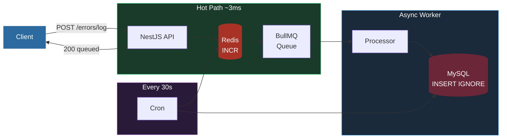
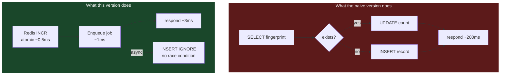
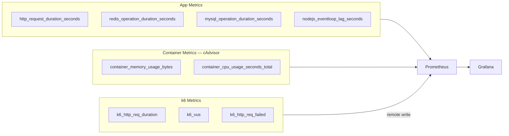
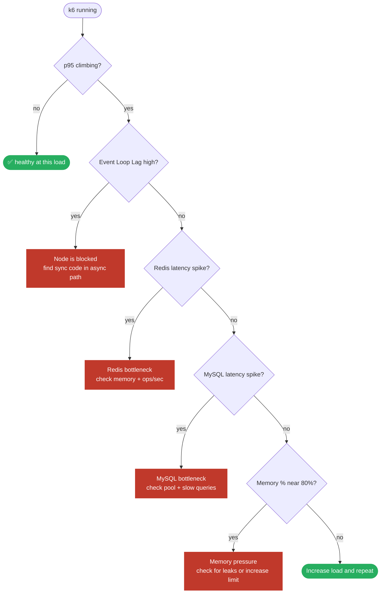

# high-throughput-error-ingestion

An async error deduplication pipeline built to understand what changes when you move the database out of the request path.

Built as a deliberate contrast to [error-logger-naive-to-production](https://github.com/yourusername/error-logger-naive-to-production) — same problem, different architecture, very different results under load.

***

## Architecture



The API responds after enqueuing to Redis (~3ms). MySQL never touches the hot path.

***

## How a Request Flows

```mermaid
sequenceDiagram
    actor Client
    participant API as NestJS
    participant R as Redis
    participant Q as BullMQ
    participant W as Worker
    participant DB as MySQL

    Client->>API: POST /errors/log

    rect rgb(20, 60, 40)
        note right of API: Hot path — ~3ms
        API->>API: SHA256 → fingerprint
        API->>R: INCR error:{fingerprint}
        API->>Q: enqueue job
        API-->>Client: 200 { status: "queued" }
    end

    rect rgb(20, 40, 70)
        note right of Q: Async — decoupled
        Q-->>W: process job
        W->>DB: INSERT IGNORE
    end

    rect rgb(50, 20, 70)
        note right of DB: Every 30s
        API->>R: read all fingerprint counts
        API->>DB: UPSERT count + lastSeenAt
    end
```



***

## Why Each Decision Was Made



| Decision | Why |
|---|---|
| `Redis INCR` instead of `UPDATE count++` | Atomic. No lock. No race. ~0.5ms vs ~20ms |
| `INSERT IGNORE` instead of `findOne + insert` | DB enforces uniqueness. No app-level race condition possible |
| BullMQ queue instead of direct DB write | API response time becomes Redis speed, not MySQL speed |
| Cron sync every 30s | 1 DB write per fingerprint per 30s instead of 1 per request |

***

## Stack

| Layer | Tech | Purpose |
|---|---|---|
| HTTP | NestJS | API framework |
| Cache + Queue | Redis + BullMQ | Atomic counters, async job transport |
| Database | MySQL + TypeORM | Persistent storage |
| Metrics | prom-client | Prometheus histograms per layer |
| Containers | cAdvisor | CPU + memory per container |
| Dashboards | Grafana | Everything on one screen during load test |
| Load Testing | k6 | Traffic generation + Prometheus remote write |

***

## Project Structure

```
src/
├── errors/
│   ├── errors.controller.ts    ← one job: accept request, call service
│   ├── errors.service.ts       ← hot path: hash + Redis INCR + enqueue
│   ├── errors.processor.ts     ← async worker: INSERT IGNORE
│   ├── errors.repository.ts    ← DB layer with timing metrics
│   ├── errors.cron.ts          ← Redis → MySQL count sync every 30s
│   └── dto/log-error.dto.ts
├── shared/
│   ├── decorators/inject-redis.decorator.ts
│   └── metrics/metrics.module.ts
├── entities/error.entity.ts
├── app.module.ts
└── main.ts

docker/
├── docker-compose.yml
├── prometheus/prometheus.yml
└── grafana/dashboards/app-overview.json
```

***

## Observability

Every layer has its own Prometheus histogram. During a k6 run, Grafana shows all of them on the same timeline.



### How to read Grafana during a load test



***

## Load Test Results

Same k6 script. Same hardware. Two architectures.

| VUs | Repo 1 (sync) | Repo 2 (async) |
|---|---|---|
| 10 | ~20ms, 0% errors | ~3ms, 0% errors |
| 50 | ~80ms, 0% errors | ~4ms, 0% errors |
| 100 | ~300ms, 2% errors | ~5ms, 0% errors |
| 200 | ~800ms, 15% errors | ~6ms, 0% errors |
| 500 | ~1800ms, 60% errors | ~8ms, 0% errors |

The gap is not from better hardware. It is from removing MySQL from the request path.

***

## Running the Tests

```bash
# Start full stack (app + mysql + redis + prometheus + grafana + cadvisor)
docker compose up -d

# Gradual ramp  0 → 50 → 200 → 500 VUs
k6 run -o experimental-prometheus-rw load-test.js

# Sudden spike to 1000 VUs
k6 run --env SCENARIO=spike -o experimental-prometheus-rw load-test.js

# 30 min soak — watch for memory leaks + Redis key growth
k6 run --env SCENARIO=soak -o experimental-prometheus-rw load-test.js
```

| Dashboard | URL |
|---|---|
| Grafana | http://localhost:3000 |
| Prometheus | http://localhost:9090 |
| App health | http://localhost:9002/health |
| App metrics | http://localhost:9002/metrics |

***

## Container Memory Limit Experiment

The backend container is capped at **1 GB** in `docker-compose.yml`.

During the soak test, watch the **Memory % Used** gauge in Grafana. Normal load stays around 20–30%. A memory leak shows as a steady climb toward 80–90% over 30 minutes.

```promql
100 * container_memory_usage_bytes{container_label_com_docker_compose_service="backend",image!=""}
    / container_spec_memory_limit_bytes{container_label_com_docker_compose_service="backend",image!=""}
```

***

## Known Limits of This Design

| Limit | Impact | What comes next |
|---|---|---|
| Redis is a single point of failure | Queue + counters fail together | Redis Sentinel / Cluster |
| Queue depth is unbounded | Worker lag under sustained spike | `maxSize` + Dead Letter Queue |
| Redis key count grows with unique errors | Memory pressure over time | TTL on keys + archive to cold storage |

***

## What This Taught Me

Async architecture is not about making the code more complex. It is about deciding which parts of the system need to be fast (the API response) and which parts just need to eventually be correct (the DB write). Once that boundary is clear, the design follows naturally.

***

## See Where It Started

👉 **[error-logger-naive-to-production](https://github.com/yourusername/error-logger-naive-to-production)**

The synchronous version. No queue, no Redis, one table. Worth reading first.
